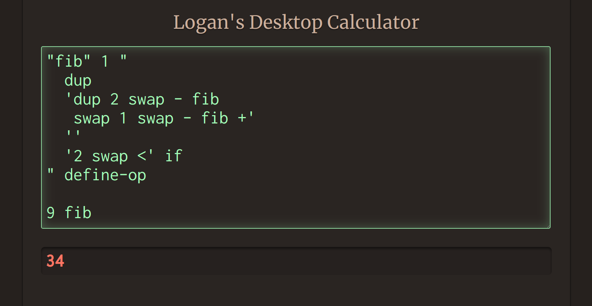

# Logan's Desktop Calculator
*Not your regular four-function*


## Sample programs
### Two and two
```C
2 2 +
```
*4*

### Circle area 
```C
3 "radius" store
// do other things
2 "radius" load ^ 3.141 * 
```
*28.269*

### Map-reduce with builtins
```C
"square" 1 "2 swap ^" define-op // create an operator that squares a number
1 10 0 range                    // 0 through 9, step size 1
"square" map                    // 0 1 4 9 16 ...
"+" reduce
```
*285*

### Fibonacci
```C
"fib" 1 "
  dup
  'dup 2 swap - fib
   swap 1 swap - fib +'
  ''
  '2 swap <' if
" define-op

9 fib
```
*34*

### Working with the whole stack
```C
"+space" 2 "swap ' ' swap + +" define-op
"save-stack" 1 "
  '_name' store
  '' '+space' reduce
  '_name' load store
  '_name' delete
" define-op
"load-stack" 1 "load eval" define-op
"clear-stack" 0 "'pop' map" define-op

1 2 3 "stack" save-stack
5 6 clear-stack
"stack" load-stack
```

### Implementing block scoping
```C
// from previous example
spacecat 2 (swap " " swap + +) define-op
save-stack 0 ("" (spacecat) reduce) define-op

// implement increment- and decrement-and-return for a counter
0 _c store
_scope 0 (_c load dup 1 + _c store) define-op
_unscope 0 (_c load 1 swap - dup _c store) define-op

// implement brackets as operators that save and load the stack
{ 0 (save-stack _scope _stack + store) define-op
} 0 (_unscope _stack + load eval) define-op

2 2 (+) reduce { 1 2 (+) reduce } -
```

### Anonymous operators
```C
0 "_uuid_counter" store
"uuid" 0 "'_uuid_counter' load dup 1 + '_uuid_counter' store '$$' +" define-op

"n-op" 1 "
  '_arity' store          // save first arg
  uuid dup '_id' store    // generate name for op
  swap '_arity' load swap // reorder args for define-op 
  define-op               // define 'anonymous' op
  '_id' load              // return generated name
  '_id' '_arity' delete delete
" define-op
"unop" 1 "1 n-op" define-op
"binop" 1 "2 n-op" define-op

1 2 3 "2 swap ^" unop map
```
*9 4 1*
