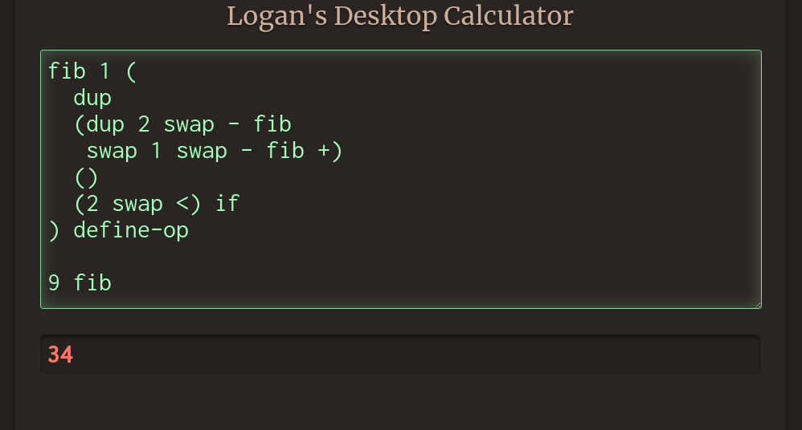

# Logan's Desktop Calculator
*Not your regular four-function*


## Sample programs
### Two and two
```C
2 2 +
```
*4*

### Circle area 
```C
3 "radius" store
// do other things
2 "radius" load ^ 3.141 * 
```
*28.269*

### Map-reduce
```C
"square" 1 "2 swap ^" define-op // create an operator that squares a number
1 10 0 range                    // 0 through 9, step size 1
"square" map                    // 0 1 4 9 16 ...
"+" reduce
```
*285*

### Fibonacci
```C
"fib" 1 "
  dup
  'dup 2 swap - fib
   swap 1 swap - fib +'
  ''
  '2 swap <' if
" define-op

9 fib
```
*34*
